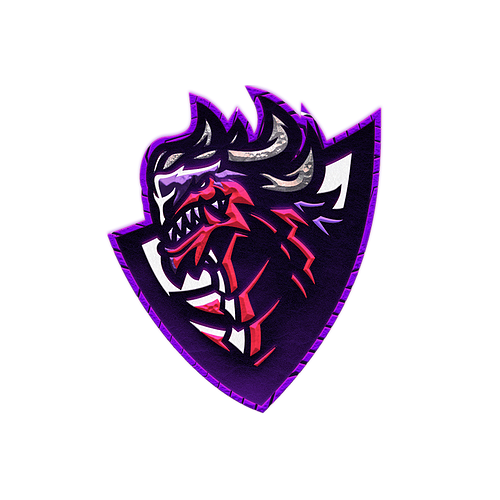

## Over World Gaming

Overworld is a gaming-focused community token that generates reflections to all holders and pools money for giveaways, team recruitment, and tournament hosting, enhancing the gaming experience while simultaneously adding value to the token holders. The rapid transition into the universe of electronic sports proved that its market scope is wide enough to welcome everyone's contribution within the sphere. Overworld aims to bring innovative methodologies into the gaming industry by infusing this contribution through the crypto market economics.

### App
https://eliortabeka.github.io/owgaming/

### Info
The app helps OW holders to check their current wallet balance.
